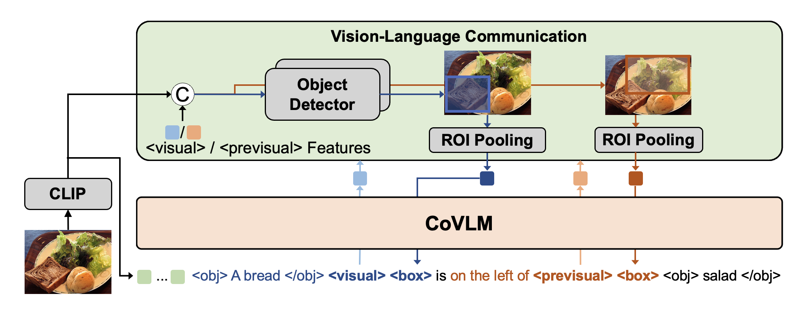

# CoVLM: Composing Visual Entities and Relationships in Large Language Models Via Communicative Decoding



This repository contains the official code for CoVLM: Composing Visual Entities and Relationships in Large Language Models Via Communicative Decoding.

[[Project Page](https://vis-www.cs.umass.edu/CoVLM)] [[Paper](https://arxiv.org/abs/2311.03354)]

## News and ToDo List

* [ ] Release training scripts
* [ ] Release pre-training dataset
* [ ] Release demo
* [X] 2023-11-1: Release 1.4B/2.8B checkpoint
* [X] 2023-11-1: Release initial code

## Installation

```bash
conda create -n covlm python=3.9
conda activate covlm
# CUDA 10.2
conda install pytorch==1.12.1 torchvision==0.13.1 torchaudio==0.12.1 cudatoolkit=10.2 -c pytorch
# CUDA 11.3
conda install pytorch==1.12.1 torchvision==0.13.1 torchaudio==0.12.1 cudatoolkit=11.3 -c pytorch
# CUDA 11.6
conda install pytorch==1.12.1 torchvision==0.13.1 torchaudio==0.12.1 cudatoolkit=11.6 -c pytorch -c conda-forge
pip install -e transformers/
pip install -e YOLOX/
pip install -r requirements.txt
pip install -e .
python -m spacy download en_core_web_md
```

## Checkpoint

| Model      | vision encoder | LLM         | Checkpoint                                                                           |
| ---------- | -------------- | ----------- | ------------------------------------------------------------------------------------ |
| CoVLM-1.4B | ViT-L-14       | pythia-1.4b | [Hugging Face](https://huggingface.co/senfu/covlm-1.4b/resolve/main/checkpoint_18000.pt) |
| CoVLM-2.8B | ViT-L-14       | pythia-2.8b | [Hugging Face](https://huggingface.co/senfu/covlm-2.8b/resolve/main/checkpoint_15000.pt) |

## Evaluation

### Prepare evaluation datasets

### RefCOCO/RefCOCOg/RefCOCOplus

```bash
bash eval_refcocog.sh CHECKPOINT
```

### Cola

```bash
bash eval_cola.sh CHECKPOINT
```

### ARO

```bash
bash eval_aro.sh CHECKPOINT
```

### VQAv2

```bash
bash eval_vqav2.sh CHECKPOINT
```

### More tasks will be available soon

## Citation

If our work is useful or relevant to your research, please kindly recognize our contributions by citing our paper:

```
@misc{li2023covlm,
      title={CoVLM: Composing Visual Entities and Relationships in Large Language Models Via Communicative Decoding}, 
      author={Junyan Li and Delin Chen and Yining Hong and Zhenfang Chen and Peihao Chen and Yikang Shen and Chuang Gan},
      year={2023},
      eprint={2311.03354},
      archivePrefix={arXiv},
      primaryClass={cs.CV}
}
```
